# Geburtstags-Quiz

---

# Regeln
* 3 Runden {.fragment .fade-up}
* ca 15 Minuten pro Runde {.fragment .fade-up}
* Gruppen {.fragment .fade-up}
* Keine Handys {.fragment .fade-up}

---

# Spiel #1
## Lieder raten

--

# Aufgabe
* 3 Liedergruppen a 4 Lieder {.fragment .fade-up}
* Titel & Interpret von jedem Song {.fragment .fade-up}
* Jede Liedergruppe hat eine Gemeinsamkeit {.fragment .fade-up}
    * Gleiches Instrument
    * Lieder über eine bestimmte Personengruppe
    * Coverlieder 
    * ... 

---

# Spiel #1
## Lösung

--

# Gruppe 1

* Survivor - Eye of the Tiger {.fragment .fade-up}
* Whitney Houston - I will always love you {.fragment .fade-up}
* Elton John - Can you feel the love tonight {.fragment .fade-up}
* Xavier Naidoo - Sie sieht mich nicht {.fragment .fade-up}

Gemeinsamkeit: Filmmusik

--

# Gruppe 2
* A-Ha - Take on me {.fragment .fade-up}
* Modern Talking - You’re my heart, you’re my soul {.fragment .fade-up}
* Tears for fears - Shout {.fragment .fade-up}
* Opus - Life is life {.fragment .fade-up}

Gemeinsamkeit: Gleiches Erscheinungsjahr (1985)
--

# Gruppe 3
* Lena - Satelite {.fragment .fade-up}
* Olsen Brothers - Fly on the wings of love {.fragment .fade-up}
* Abba - Waterloo {.fragment .fade-up}
* Udo Jürgens - Merci Cherie {.fragment .fade-up}

Gemeinsamkeit: Eurovision Song Contest Gewinner

---

# Spiel #2
## Der zweite Gewinner ist der erste Verlierer

--

# Aufgabe
* Es werden Fragen- und Antwortzettel ausgeteilt
* 15 Minuten Zeit

--

# Beispiele
* Amtierender Vizekanzler? {.fragment .fade-up}
    * Olaf Scholz {.fragment .fade-up}
* Zweitgrößtes Land der Erde? {.fragment .fade-up}
    * Kanada {.fragment .fade-up}

---

# Spiel #2
## Lösungen

--

* Zweithöchster Berg Deutschlands: Hochwanner
* Fussball Vizeweltmeister: Kroatien 
* Zweite Strophe Oh Tannenbaum: "du kannst mir sehr gefallen!"
* Schwester von Christl: Gaby Wacker
* Zweites Buch Harry Potter: Kammer des Schreckens
* Zweite der 10 Plagen: Frösche

--

* Zweite Frau von Dieter Bohlen: Nadja Abd el Farrag (Naddel)
* Zweite binomische Formel: (a - b)² = a² - 2ab + b²
* Chemisches Element mit Ordnungszahl 2: Helium
* Zweiter Bundespräsident: Heinrich Lübke
* Zweites der 10 Gebote: "Du sollst den Namen des Herrn, deines Gottes, nicht mißbrauchen." 
* Zweites Lied im zweiten Block: Modern Talking - You’re my heart, you’re my soul 

---

# Spiel #3
## Ortsendungen

--

# Aufgabe
* Deutschlandkarte mit eingefärbtem Gebiet und Anzahl der Orte
* Zuordnung zu Ortsendungen
* 15 Minuten Zeit

--

# Beispiel
<table border="1">
<tr> 
<td style="position:relative; top:0; left:0;">
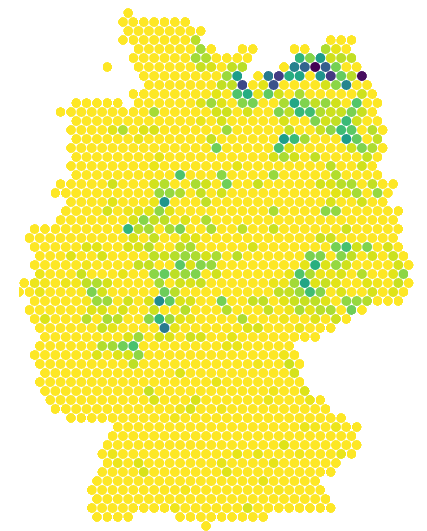
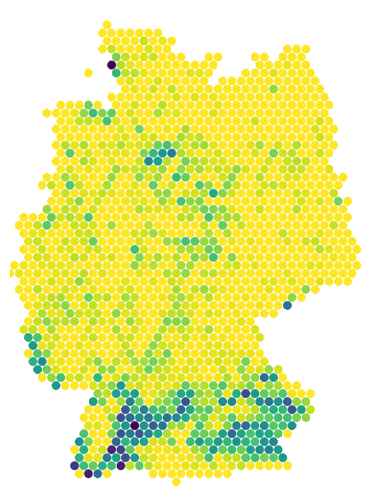
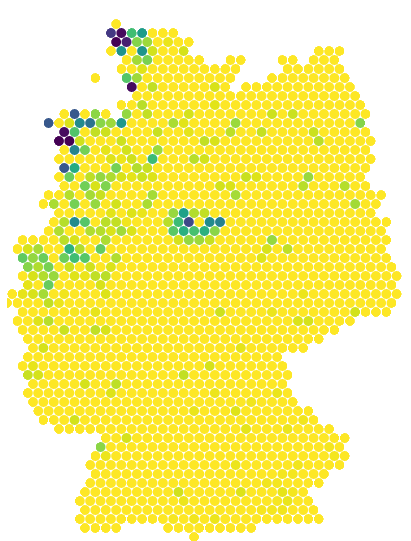
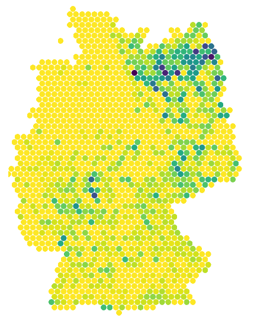
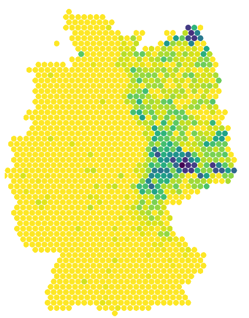
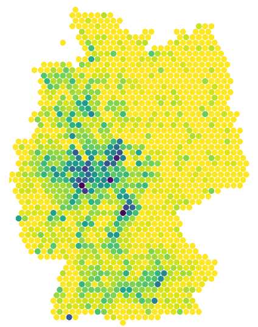
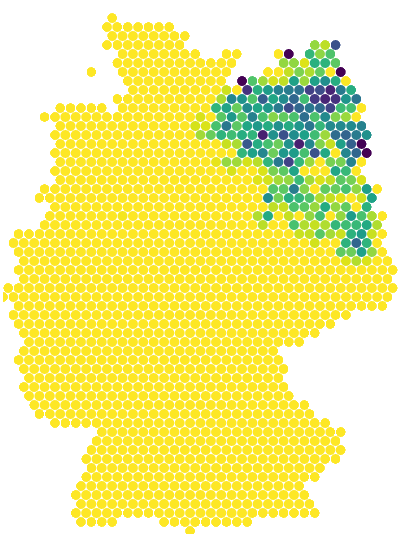
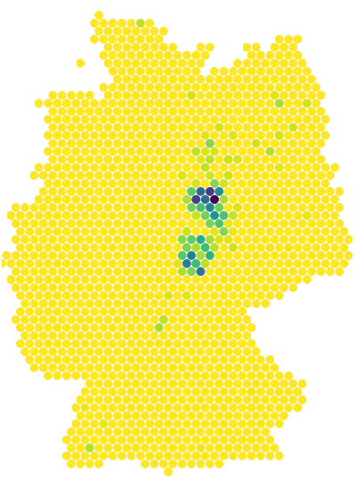
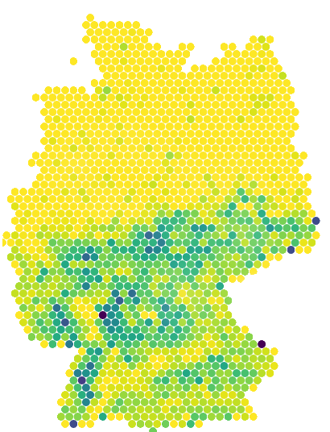
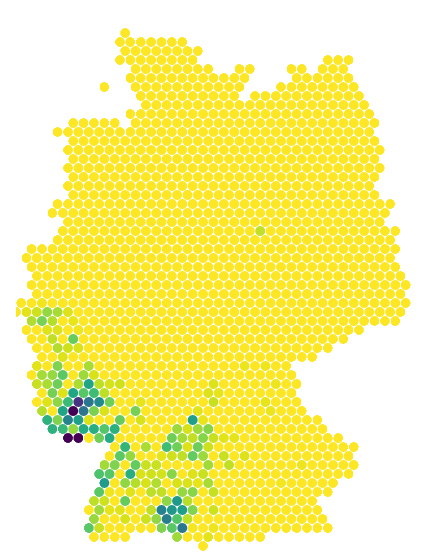
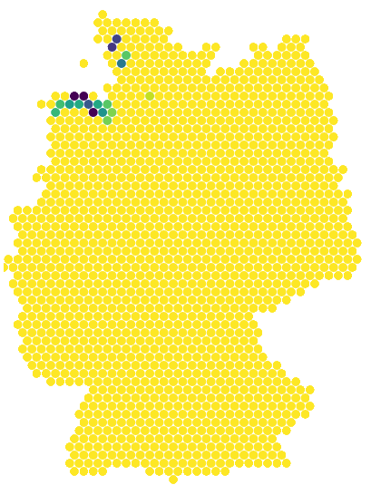
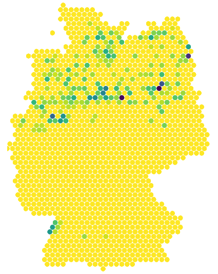
</td>
<td>

*  -hag
*  -hausen
*  -horst
*  -in
*  -ing
*  -itz
*  -leben
*  -ow
*  -siel
*  -um
*  -weiler

</td>
</tr>
</table>